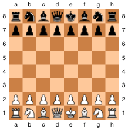

# Atomic Chess

A Python implementation of Atomic Chess - a variant of standard chess where all captures trigger an explosion. This project was built using **object-oriented programming** principles and is playable in the terminal via a command-line interface.

---

## What Is Atomic Chess?

Atomic Chess modifies the rules of classical chess by adding explosions:

- When a piece is captured, all adjacent non-pawn pieces, including the capturing piece, are also removed from the board.
- Pawns are only removed if directly captured.
- Kings cannot capture and are immune to mutual destructionn.
- The game ends when a king is destroyed by an explosion.

---

## Features

- Full 8x8 chessboard setup and display
- Class-based implementation for all piece types
- Piece-specific movement and validation logic
- Algebraic notation input (e.g., `e2`, `g5`)
- Explosions remove surrounding non-pawn pieces after a capture
- Win detection when a king is destroyed
- Interactive terminal-based gameplay with real-time board rendering

This project demonstrates the following concepts:
- Object-oriented design with class inheritance
- Chess logic and state tracking
- Move validation with conditional logic
- Explosion mechanics and adjacency checks
- Input handling via algebraic notation parsing

---

## Project Structure

- `ChessVar.py` — main game logic, including piece classes and board management
- `main.py` — command-line interface for playing the game

---

## How to Play

1. Clone this repo or download `ChessVar.py` and `main.py`.
2. Run the game in your terminal:

```bash
python main.py
```

3. Enter moves using standard chess notation:

```
Move from: e2
Move to: e4
```

- White goes first
- The game ends when a king is destroyed in an explosion

---

## Starting Board Layout



---

## Author

Developed by Anna Kaza

Connect with me at annakaza06@gmail.com or www.linkedin.com/in/anna-kaza